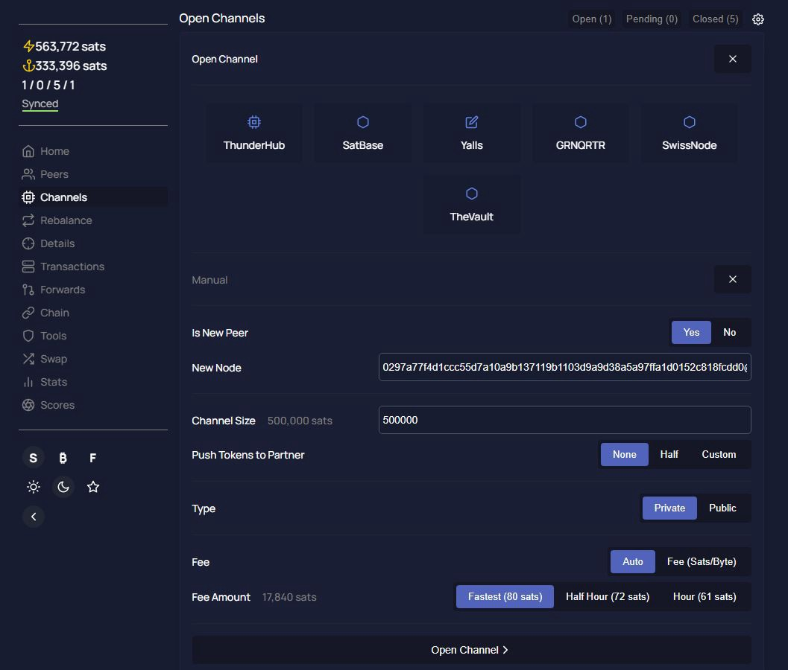

# Bonus Guide: Install ThunderHub
{: .no_toc }

---

[ThunderHub](https://github.com/apotdevin/thunderhub){:target="_blank"} is an open source LND node manager where you can manage and monitor your node on any device or browser. It allows you to take control of the lightning network with a simple and intuitive UX and the most up-to-date tech stack.

Difficulty: Medium
{: .label .label-yellow }

Status: Tested v3
{: .label .label-green }



---

Table of contents
{: .text-delta }

1. TOC
{:toc}

---

## Requirements

* Node.js v14.15+
* NPM

---

## Preparations

### Check Node.js and npm

* Node.js v16 and npm should have been installed for the BTC RPC Explorer or RTL. We can check our version of Node.js with user "admin": 
  
  ```sh
  $ node -v
  > v16.13.2
  npm --version
  > v8.3.1
  ```

* If the version is v14.15 or above, you can move to the next section. If Node.js is not installed, follow [this guide](https://raspibolt.org/btcrpcexplorer.html#install-nodejs){:target="_blank"} to install it.

### Firewall & reverse proxy

* Enable NGINX reverse proxy to route external encrypted HTTPS traffic internally to ThunderHub

  ```sh
  $ sudo nano /etc/nginx/streams-enabled/thunderhub-reverse-proxy.conf
  ```

  ```sh
  upstream rtl {
    server 127.0.0.1:3010;
  }
  server {
    listen 4002 ssl;
    proxy_pass rtl;
  }
  ```

* Test and reload NGINX configuration

  ```sh
  $ sudo nginx -t
  $ sudo systemctl reload nginx
  ```

* Configure firewall to allow incoming HTTPS requests

  ```sh
  $ sudo ufw allow 4002/tcp comment 'allow TunderHub SSL'
  $ sudo ufw status
  ```
  
---

## ThunderHub

### Data directory

We do not want to run ThunderHub alongside `bitcoind` and `lnd` because of security reasons.
For that we will create a separate user and we will be running the code as the new user.

* Create a new "thunderhub" user and copy the LND credentials

  ```sh
  $ sudo adduser --disabled-password --gecos "" thunderhub
  $ sudo cp ~/.lnd/data/chain/bitcoin/mainnet/admin.macaroon /home/thunderhub/admin.macaroon
  $ sudo chown thunderhub:thunderhub /home/thunderhub/admin.macaroon
  ```

* Create a data directory to store the configuration files

  ```sh
  $ sudo mkdir /data/thunderhub
  $ sudo chown thunderhub:thunderhub /data/thunderhub
  ```

* Log in with the "thunderhub" user and create a link to the LND data directory

  ```sh
  $ sudo su - thunderhub
  $ ln -s /data/lnd /home/thunderhub/.lnd
  ```

* Download the source code directly from GitHub and install all dependencies using NPM.

  ```sh
  $ git clone https://github.com/apotdevin/thunderhub.git
  $ cd thunderhub
  ```

### Configuration

We set up the program and user account configuration files.

* Still with user "thunderhub", make a local copy of the configuration file that will be preserved during future updates.

  ```sh
  $ cp ~/thunderhub/.env /data/thunderhub/.env.local
  $ ln -s /data/thunderhub/.env.local ~/thunderhub/.env.local
  $ nano ~/thunderhub/.env.local
  ```

* In the "Server config" section, add the following two lines at the end. It enables the use of our Tor Proxy server for external links and to use port 3010 as the default port 3000 is already used for Ride The Lightning.

  ```ini
  TOR_PROXY_SERVER=socks://127.0.0.1:9050
  PORT=3010
  ```

* In the "URLs" section, add the following line at the end. It enables the use our own self-hosted blockchain explorer for better privacy.

  ```ini
  MEMPOOL_URL='https://raspibolt.local:4000/'
  ---

* We can enable the fetching of the bitcoin price and miner fees because we enabled the Tor proxy server which ThunderHub will use to privately make the requests. However, we disable external  In the "Privacy" section, add the following lines at the end. You might also want to enable external links

  ```ini
  FETCH_PRICES=true 
  FETCH_FEES=true
  DISABLE_LINKS=true
  DISABLE_LNMARKETS=true
  NO_VERSION_CHECK=true
  ```

* In the "Accounts config" section, uncomment the `ACCOUNT_CONFIG_PATH` option and set the path to `/data/thunderhub/thubConfig.yaml`. Save and exit.

  ```ini
  ACCOUNT_CONFIG_PATH='/data/thunderhub/thubConfig.yaml'
  ```

* Create the server account YAML file and restricts its read permission to the "thunderhub" user only

  ```sh
  $ nano /data/thunderhub/thubConfig.yaml
  $ chmod 600 /data/thunderhub/thubConfig.yaml
  ```

* Paste the following configuration. Paste your ThunderHub password. Save and exit.

  ```ini
  masterPassword:"YourStrongThunderHubPassword"
  accounts:
  - name: RaspiBolt
    serverUrl: 127.0.0.1:10009
    macaroonPath: "/home/thunderhub/admin.macaroon"
    certificatePath: "/data/lnd/tls.cert"
  ```

### Installation

* Still with user "ThunderHub" and still inside `~/thunderhub`, install ThunderHub

  ```sh
  $ npm install
  $ npm run build
  $ npm prune --production
  ```

## First Start

Test starting ThunderHub manually first to make sure it works.

* Let's do a first start to make sure it's running as expected. 
  Make sure we are in the thunderhub directory and start the web server.

 ```sh
  $ cd ~/thunderhub
  $ npm run start -p 3010
  ```

* Now point your browser to [https://raspibolt.local:4002](http://raspibolt.local:4002){:target="_blank"} (or whatever you chose as hostname) or the ip address (e.g. `http://192.168.0.20:4002`).
  You should see the home page of ThunderHub.

* Stop ThunderHub in the terminal with `Ctrl`-`C` and exit the "thunderhub" user session.

  ```sh
  $ exit
  ```

---

## Autostart on boot

Now we'll make sure ThunderHub starts as a service on the Raspberry Pi so it's always running.
In order to do that we create a systemd unit that starts the service on boot directly after LND.

* As user "admin", create the service file.

  ```sh
  $ sudo nano /etc/systemd/system/thunderhub.service
  ```

* Paste the following configuration. Save and exit.

  ```ini
  # RaspiBolt: systemd unit for ThunderHub
  # /etc/systemd/system/thunderhub.service

  [Unit]
  Description=ThunderHub
  After=lnd.service

  [Service]
  WorkingDirectory=/home/thunderhub/thunderhub
  ExecStart=/usr/bin/npm run start -p 3010
  User=thunderhub
  
  Restart=always
  TimeoutSec=120
  RestartSec=30

  [Install]
  WantedBy=multi-user.target
  ```

* Enable the service, start it and check log logging output.

  ```sh
  $ sudo systemctl enable thunderhub
  $ sudo systemctl start thunderhub
  $ sudo journalctl -f -u thunderhub
  ```

* You can now access ThunderHub from within your local network by browsing to [https://raspibolt.local:3010](http://raspibolt.local:4002){:target="_blank"} (or your equivalent IP address).

### Security

We recommend setting up 2FA (e.g., with the FOSS app [Aegis](https://getaegis.app/){:target="_blank"}).

* Open ThunderHub and click on the "Settings" cogwheel (top right corner)
* Go to the "Security" and enable 2FA.
* For better privacy, do not scan the QR code but enter the secret code manually in your 2FA app

**Congratulations!**
You now have ThunderHub running to manage your Lightning service on our own node.

---

## Remote access over Tor (optional)

Do you want to access ThunderHub remotely?
You can easily do so by adding a Tor hidden service on the RaspiBolt and accessing ThunderHub with the Tor browser from any device.

* Add the following three lines in the section for "location-hidden services" in the `torrc` file.
  Save and exit.

 ```sh
  $ sudo nano /etc/tor/torrc
  ```

  ```ini
  HiddenServiceDir /var/lib/tor/thunderhub
  HiddenServiceVersion 3
  HiddenServicePort 80 127.0.0.1:3010
  ```

* Restart Tor and get your connection address.

  ```sh
  $ sudo systemctl restart tor
  $ sudo cat /var/lib/tor/thunderhub/hostname
  > abcdefg..............xyz.onion
  ```

* With the [Tor browser](https://www.torproject.org){:target="_blank"}, you can access this onion address from any device.
  Please be aware that this access is not password protected and should not be shared widely.

---

## Update

Updating to a [new release](https://github.com/apotdevin/thunderhub/releases){:target="_blank"} should be straight-forward.

* From user "admin", stop the service and open a "thunderhub" user session.

  ```sh
  $ sudo systemctl stop thunderhub
  $ sudo su - thunderhub
  ```

* Fetch the latest GitHub repository information and check out the new release:

  ```sh
  $ cd thunderhub
  $ git pull
  $ npm install
  $ npm run build
  $ exit
  ```

* Start the service again.

  ```sh
  $ sudo systemctl start thunderhub
  ```
  
---

## Uninstall

* Stop and delete the systemd sevice

  ```sh
  $ sudo systemctl stop thunderhub
  $ sudo rm /etc/systemd/system/thunderhub.service
  ```

* With the "root" user, delete the "thunderhub" user. Exit the "root" user session and go back to "admin".

  ```sh
  $ sudo su - 
  $ userdel -r thunderhub
  $ exit
  ```

* Display the UFW rule numbers for ThunderHub (e.g. below, X and Y) and delete them

  ```sh
  $ sudo ufw status numbered
  > [...]
  > [X] 4002/tcp                   ALLOW IN    Anywhere                   # allow TunderHub SSL
  > [Y] 4002/tcp (v6)              ALLOW IN    Anywhere (v6)              # allow TunderHub SSL
  $ sudo ufw delete [Y]
  $ sudo ufw delete [X]
  $ sudo ufw status
  ```

* Delete the ThunderHub data directory

  ```sh
  $ sudo rm -r /data/thunderhub
  ```

* Remove the ThunderHub reverse proxy server file and reload NGINX

  ```sh
  $ sudo rm /etc/nginx/streams-enabled/thunderhub-reverse-proxy.conf
  $ sudo nginx -t
  $ sudo systemctl reload nginx
  ``` 

---


<br /><br />
  
  
<<Back: [+ Lightning](index.md)
