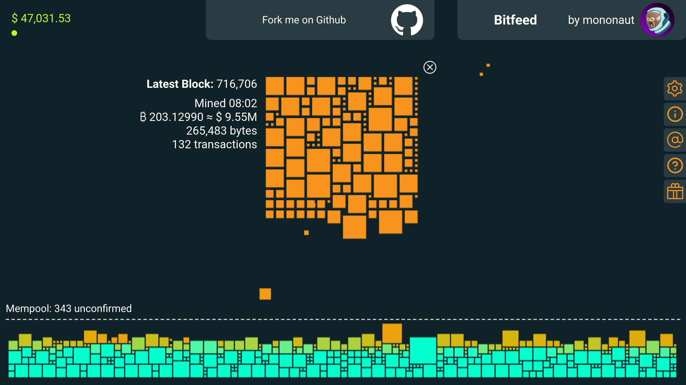

## Bonus guide: Bitfeed
{: .no_toc }

---

[Bitfeed](https://github.com/bitfeed-project/bitfeed){:target="_blank"} is a live visualization of the Bitcoin network activity, focusing on the journey from unconfirmed transactions to confirmed blocks. It is also a blockchain explorer.

Difficulty: Simple
{: .label .label-green }

Status: Tested v3
{: .label .label-green }



---

Table of contents
{: .text-delta }

1. TOC
{:toc}

---

## Requirements

---

## Preparations

### Elixir

We install the programming language [Elixir](https://elixir-lang.org/){:target="_blank"}.

* Update the package index files and install the latest version of Elixir 

  ```sh
  $ sudo apt update
  $ sudo apt install elixir
  $ elixir -v
  > [...]
  > Elixir 1.10.3 (compiled with Erlang/OTP 22)
  ```

### Firewall

---

## Installation

### Clone the repository

For improved security, we create the new user "bitfeed" that will run the explorer. Using a dedicated user limits potential damage in case there's a security vulnerability in the code. An attacker would not be able to do much within this user's permission settings.

* Create a new user, assign it to the "bitcoin" group, and open a new session

  ```sh
  $ sudo adduser --disabled-password --gecos "" bitfeed
  $ sudo adduser bitfeed bitcoin
  $ sudo su - bitfeed
  ```

* Download the source code directly from GitHub

  ```sh
  $ git clone https://github.com/bitfeed-project/bitfeed.git
  $ cd bitfeed
  ```
  
### Server


  ```sh
  $ cd server
  $ mix do deps.get
  $ mix do deps.compile
  ```
