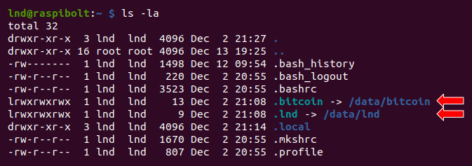

<!-- markdownlint-disable MD014 MD022 MD025 MD033 MD040 -->

# Liquid
{: .no_toc }

We set up [Liquid](https://github.com/ElementsProject/elements){:target="_blank"} by [Blockstream](https://docs.blockstream.com/liquid/technical_overview.html){:target="_blank"}.

---

## Table of contents
{: .no_toc .text-delta }

1. TOC
{:toc}

---

## Installation

The installation of Liquid is straight-forward, but the application is quite powerful and capable of things not explained here. Check out their [Docs](https://docs.blockstream.com/index.html){:target="_blank"} for a wealth of information about their open-source projects.

### Download

We'll download, verify and install Elements/Liquid.

* As user "admin", download the application, checksums and signature

  ```sh
  $ cd /tmp
  $ wget https://github.com/ElementsProject/elements/releases/download/elements-0.21.0.1/elements-elements-0.21.0.1-aarch64-linux-gnu.tar.gz
  $ wget https://github.com/ElementsProject/elements/releases/download/elements-0.21.0.1/SHA256SUMS.asc
  ```

* SIGNATURE TBD

* Verify the signed checksum against the actual checksum of your download

  ```sh
  $ sha256sum --check SHA256SUMS.asc --ignore-missing
  > elements-elements-0.21.0.1-aarch64-linux-gnu.tar.gz: OK
  > sha256sum: WARNING: 19 lines are improperly formatted

  ```

* Install Elements

  ```sh
  $ tar -xzf elements-elements-0.21.0.1-aarch64-linux-gnu.tar.gz
  $ sudo install -m 0755 -o root -g root -t /usr/local/bin elements-elements-0.21.0.1/bin/*
  $ elementsd --version
  > Elements Core version elements-0.21.0.1
  > [...]
  ```

### Data directory

Now that Elementsd is installed, we need to configure it to work with Bitcoin Core and run automatically on startup.

* Create the "elements" service user, and add it to the groups "bitcoin" and "debian-tor"

  ```sh
  $ sudo adduser --disabled-password --gecos "" elements
  $ sudo usermod -a -G bitcoin,debian-tor elements
  ```

* Add the user "admin" to the group "elements"

  ```sh
  $ sudo adduser admin elements
  ```

* Create the Elements data directory

  ```sh
  $ sudo mkdir /data/elements
  $ sudo chown -R elements:elements /data/elements
  ```

* Open a "elements" user session

  ```sh
  $ sudo su - elements
  ```

* Create symbolic links pointing to the Liquid and bitcoin data directories

  ```sh
  $ ln -s /data/elements /home/elements/.elements
  $ ln -s /data/bitcoin /home/elements/.bitcoin
  ```

* Display the links and check that they're not shown in red (this would indicate an error)

  ```sh
  $ ls -la
  ```
  

### Configuration

* Create the Liquid configuration file and paste the following content (adjust to your alias).
  Save and exit.

  ```sh
  $ nano /data/elements/elements.conf
  ```
  
  ```ini
  ### Liquid Core Daemon configuration file example
  
  # Chain is Liquid
  chain=liquidv1
  
  ### Federated peg options:
  
  # Validate pegin claims. All functionaries must run this. (default: 1)
  validatepegin=1
  
  # The address which the daemon will try to connect to validate peg-ins, if
  # enabled. (default: cookie auth)
  mainchainrpccookiefile=/home/elements/.bitcoin/.cookie
  ```

### Run elementsd

* Still with user "elements", run Elements

  ```sh
  $ elementsd
  ```
  
The Liquid blockchain will now synchronise, wait until it's completed. To check the progress, use the `elements-cli` client.

* Open a new SSH session and log in with the "elements" user

  ```sh
  $ sudo su - elements
  $ elements-cli -getinfo
  > 
  ```

